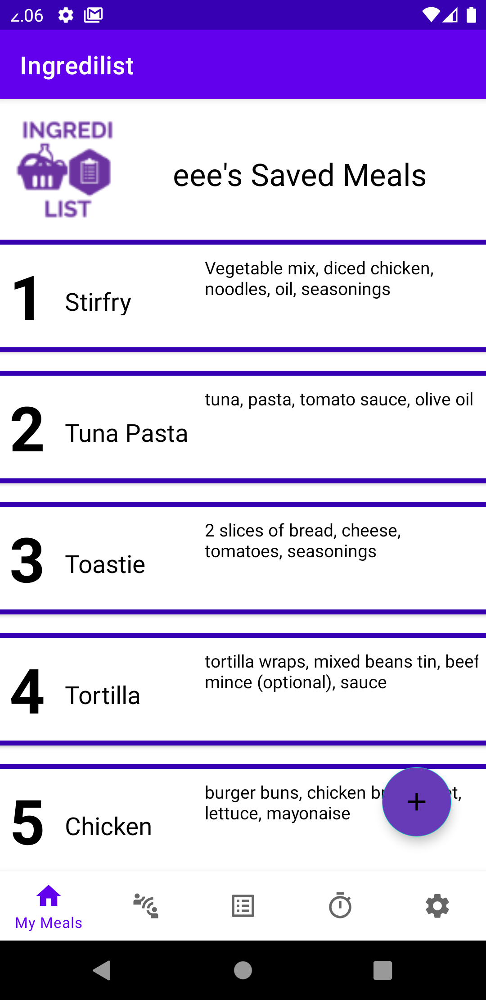

<!-- PROJECT LOGO -->
<br />
<p align="center">
  <a href="https://github.com/SaoodCS/Ingredilist">
    
  </a>

  <h3 align="center">Ingredilist Android Application</h3>

  <p align="center">
    An application for all your grocery and cooking needs. Find out more in the sections below. 
  </p>
</p>


<!-- TABLE OF CONTENTS -->
<details open="open">
  <summary>Table of Contents</summary>
  <ol>
    <li>
      <a href="#about-the-project">About The Project</a>
      <ul>
        <li><a href="#built-with">Built With</a></li>
        <li><a href="#plugins-and-packages">Plugins and Packages</a></li> 
      </ul>
    </li>
    <li>
      <a href="#getting-started">Getting Started</a>
      <ul>
        <li><a href="#prerequisites">Prerequisites</a></li>
        <li><a href="#installation">Installation</a></li>
      </ul>
    </li>
    <li><a href="#user-guide">User Guide</a></li>
    <li><a href="#contributing">Contributing</a></li>
    <li><a href="#license">License</a></li>
    <li><a href="#contact">Contact</a></li>
  </ol>
</details>


<!-- ABOUT THE PROJECT -->
## About The Project

<p>
<h3>Example Screenshot <i>(locally saved meals for user "eee"):</i></h3>
   
</p>


The purpose of this application is to ease the strenuous process of keeping on top of all your weekly grocery related chores. It includes various functionalities to fulfil this purpose. <br>
A secondary purpose of this application is to upload and share meals with the community of people using Ingredilist. Uploading your own created meals and sharing it with other like-minded individuals gives the user an opportunity to make interesting meals of their own based on the ideas of others. <br> <br>
Some of the functionalities within the application are listed below <i>(to see the full functionality in action, visit the [user guide](https://saoodcs.github.io/IngredilistUserGuide/)).</i>
* Create a meal locally
* Update a meal locally
* Delete a meal locally
* Upload/share a meal 
* Delete a shared meal 
* View shared meals by other users with their diet types
* Create a shopping list 
* Delete items on the shopping list
* Delete items on the shopping list
* Create cooking instructions with the time taken to cook per each instruction
* Set a cooking timer countdown that notifies you when it reaches 0 
* Set a shopping alarm time and date for when you would like to go shopping
* Add and save supermarket phone numbers which you can call directly from the app
* User guide is available on the Settings screen
* Ability to adapt to different screen sizes and orientations


### Built With

This section lists all major frameworks, programming languages, markup languages and database structures used throughout the project.
* [Android Studio SDK](https://developer.android.com/studio)
* [Java](https://www.java.com/en/)
* [JavaScript](https://www.javascript.com/)
* [SQLite](https://www.sqlite.org/index.html)
* [Firebase](https://firebase.google.com/)
* [HTML](https://www.w3schools.com/html/)
* [CSS](https://www.w3schools.com/css/)
* [Espresso Testing Framework](https://developer.android.com/jetpack/androidx/releases/test#espresso-3.4.0)

### Plugins and Packages
This section lists all plugins, packages, and libraries used throughout the project.
* [AlarmManager](https://developer.android.com/reference/android/app/AlarmManager)
* [Intent](https://developer.android.com/reference/android/content/Intent)
* [Content Provider](https://developer.android.com/reference/android/content/ContentProvider)
* [SQLite](https://developer.android.com/jetpack/androidx/releases/sqlite)
* [SharedPreferences](https://developer.android.com/reference/android/content/SharedPreferences)
* [BroadcastReceiver](https://developer.android.com/reference/android/content/BroadcastReceiver)
* [ShareActionProvider](https://developer.android.com/reference/android/widget/ShareActionProvider)
* [NotificationCompat](https://developer.android.com/reference/androidx/core/app/NotificationCompat)
* [Google Services Plugin](https://developers.google.com/android/guides/google-services-plugin)
* [ConstraintLayout 2.0.4](https://developer.android.com/jetpack/androidx/releases/constraintlayout)
* [RecyclerView 1.2.0](https://developer.android.com/jetpack/androidx/releases/recyclerview)
* [Firebase Authentication](https://firebase.google.com/docs/auth/android/start)
* [Firebase Database](https://firebase.google.com/docs/database)
* [Firebase Firestore](https://firebase.google.com/docs/firestore/quickstart)
* [Firebase UI 7.1.1](https://github.com/firebase/FirebaseUI-Android)
* [JUnit Testing 4.13.2](https://developer.android.com/jetpack/androidx/releases/test#ext.junit-1.1.3)
* [Espresso Testing 3.3.0](https://developer.android.com/jetpack/androidx/releases/test#espresso-3.4.0)

<!-- GETTING STARTED -->
## Getting Started

To set up this project, get a local copy up and running by either cloning this repository to Android Studio,
or downloading the ZIP file of the repository and opening it in Android Studio.


### Prerequisites

You will need to install the following software in order to run this project.
* [Android Studio](https://developer.android.com/studio)
* [Git](https://git-scm.com/downloads) (if cloning the repository)

### Installation
1. Download and install Android Studio. The download link and installation guide can be
found on the following link: [https://developer.android.com/studio/install](https://developer.android.com/studio/install)
2. Press "Clone Repository" in Android Studio. Copy the following repository URL:
   ```sh
   https://github.com/SaoodCS/Ingredilist
   ```
3. Update any gradle and build files if requested by Android Studio
4. Install an AVD emulator to run the app on in Android Studio 

5.<b> To run the app, either:</b>
<BLOCKQUOTE><BLOCKQUOTE> a. Press the play button in the top toolbar in Android Studio to run the app on the emulator. <br><br>
            <b>OR:</b>
            <br><br>
            b. Run the AVD emulator -> Once loaded, drag and drop "ingredilist apk.apk" from the projects folder
            to the emulator screen -> find the app on the android emulator and press it.
 </BLOCKQUOTE> </BLOCKQUOTE>


<!-- USAGE EXAMPLES -->
## User Guide
This application has a very comprehensive user guide highlighting how to use the app alongside all the various functionalities the 
application has to offer. This user guide also includes screenshots of every activity and fragment screen too. <br>
* The user guide is available as an integrated web app within the application itself on the settings screen, or can be accessed by clicking the following link:
[User Guide Documentation](https://saoodcs.github.io/IngredilistUserGuide/)
* If you would like to use the application without registering, just use the following details to do so:
<BLOCKQUOTE><BLOCKQUOTE> Username:<b> eee</b>
<br>
      Password:<b> eee </b>
 </BLOCKQUOTE> </BLOCKQUOTE>


<!-- CONTRIBUTING -->
## Contributing
As of now, this project isn't open to contributions. The only contributer is myself, though this may change in the future.


<!-- LICENSE -->
## License

Distributed under the MIT License.


<!-- CONTACT -->
## Contact

Saood - saood-aslam@outlook.com

Project Link: [https://github.com/SaoodCS/Ingredilist](https://github.com/SaoodCS/Ingredilist)